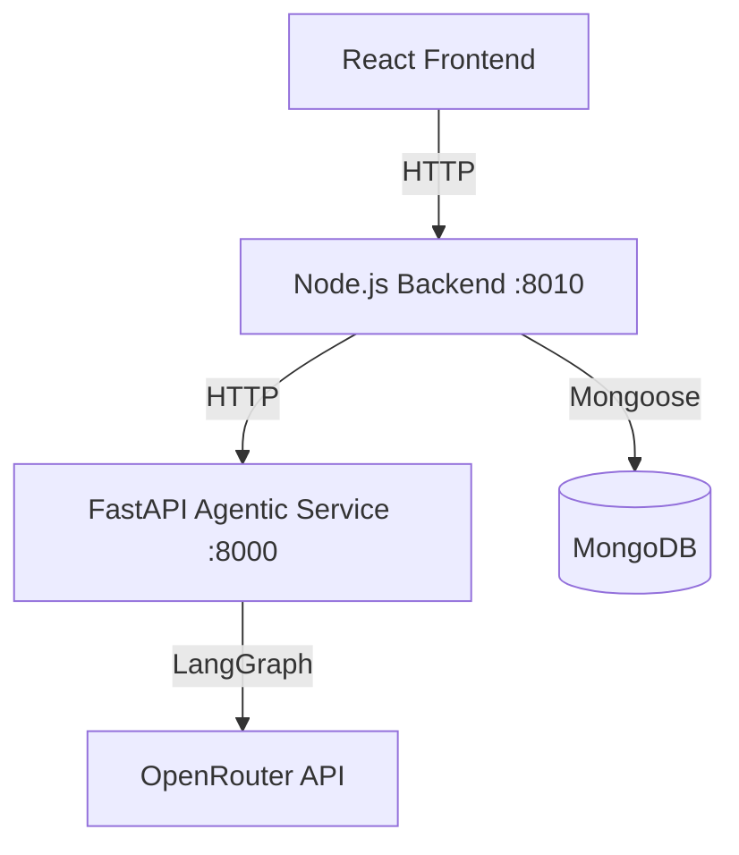

# Talksy AI

Talksy AI is a full-stack AI mock interview platform where users can practice interview rounds, receive AI-generated feedback, track historical performance, and purchase additional interview credits.

The platform supports both a classic mode (pre-generated questions and evaluations) and an **Agentic mode** powered by LangGraph, which adapts questions one-at-a-time based on candidate answers and performs parallel 3C evaluation (Confidence, Communication, Correctness).

Live on : https://talksy-ai-frontend.onrender.com

## Features

### Authentication and User Management

- Email/password signup and login with validation
- Google sign-in integration (Firebase Auth on frontend + backend session creation)
- Cookie-based authenticated session (`userToken` in HTTP-only cookie)
- Current user profile fetch and logout

### AI-Powered Interview Workflows

- **Classic Mode**: Generates all questions up front and evaluates answers sequentially.
- **Agentic Mode (LangGraph)**: Adaptive interview flow that generates questions one-at-a-time based on the candidate's previous responses, topic coverage, and strategy.
- Resume upload and parsing (`pdfjs-dist`) to extract experience, projects, and skills to personalize questions.
- Timed question-by-question interview flow.
- Voice input support via browser speech recognition.
- AI answer evaluation with structured scoring:
  - Confidence
  - Communication
  - Correctness
  - Synthesized overall feedback and score

### Reports and History

- Final interview report generation with aggregate metrics
- Question-wise answer + feedback breakdown
- Trend visualization and score insights
- PDF report export (`jsPDF` + `jspdf-autotable`)
- Interview history listing with status and score cards

### Credits and Payments

- Credit-based interview usage (20 credits per generated interview)
- Minimum credit guard before starting interview
- Razorpay order creation and signature verification
- Credit top-up after successful payment verification

### UI/UX

- Modern responsive React UI
- Framer Motion transitions and micro-interactions
- Dashboard-like cards and visual score components

## Tech Stack

### Frontend

- React 19
- Vite
- React Router
- Redux Toolkit + React Redux
- Tailwind CSS (via `@tailwindcss/vite`)
- Framer Motion
- Axios
- Recharts
- `react-speech-recognition`
- `react-circular-progressbar`
- Firebase (Google Auth)
- jsPDF + jspdf-autotable

### Node.js Backend

- Node.js
- Express 5
- Mongoose
- JWT + cookie-parser
- bcrypt
- express-validator
- Multer
- Axios
- Razorpay SDK
- pdfjs-dist

### Agentic AI Service

- Python 3.10+
- FastAPI
- LangGraph
- LangChain Core / ChatOpenRouter
- Pydantic v2
- Uvicorn
- python-dotenv

### Database

- MongoDB (via Mongoose)

### External Services

- OpenRouter API (LLM calls for resume analysis, question generation, and LangGraph workflow)
- Razorpay (payments)
- Firebase (Google sign-in)

## Architecture Overview



1. Frontend handles user interaction, interview flow state, and rendering.
2. Node.js backend manages business logic, user authentication, transactions, credits, and database persistence.
3. FastAPI service runs stateless LangGraph agents that decide the next question strategy, generate questions, run parallel evaluations, and maintain the conversation memory (summary).
4. MongoDB persists users, interviews (classic and agentic), and transactions.

---

## Installation and Setup

### 1. Clone repository

```bash
git clone <your-repo-url>
cd Talksy-ai
```

### 2. Configure Environment Variables

Create the following files:

- `backend/.env`
- `frontend/.env`
- `agentic/.env`

Use the variables listed in the next section.

### 3. Run FastAPI Agentic Service

Ensure Python 3.10+ is installed:

```bash
cd agentic

# Create and activate virtual environment
python -m venv venv
venv\Scripts\activate  # On Windows
# source venv/bin/activate  # On Linux/macOS

# Install python dependencies
pip install -r requirements.txt

# Run development server
uvicorn app.main:app --reload --port 8000
```

### 4. Run Node.js Backend

```bash
cd backend
npm install
npm start
```

The backend server runs on `http://localhost:8010` by default.

### 5. Run React Frontend

```bash
cd frontend
npm install
npm run dev
```

The Vite dev server runs on `http://localhost:5173`. When testing locally, it automatically points API requests to the local backend.

---

## Environment Variables

### Agentic Service (`agentic/.env`)

```env
OPENROUTER_API_KEY=your_openrouter_api_key
```

### Node.js Backend (`backend/.env`)

```env
PORT=8010
NODE_ENV=development
MONGO_CONNECTION_STRING=your_mongodb_uri
JWT_SECRET=your_jwt_signing_secret
OPENROUTER_API_KEY=your_openrouter_api_key
RAZORPAY_KEY_ID=your_razorpay_key_id
RAZORPAY_KEY_SECRET=your_razorpay_key_secret
AGENTIC_SERVICE_URL=http://localhost:8000
```

### React Frontend (`frontend/.env`)

```env
VITE_FIREBASE_API=your_firebase_api_key
VITE_FIREBASE_AUTH_DOMAIN=your_firebase_auth_domain
VITE_FIREBASE_PROJECT_ID=your_firebase_project_id
VITE_FIREBASE_STORAGE_BUCKET=your_firebase_storage_bucket
VITE_FIREBASE_MESSAGING_SENDER_ID=your_firebase_sender_id
VITE_FIREBASE_APP_ID=your_firebase_app_id
VITE_FIREBASE_MEASUREMENT_ID=your_firebase_measurement_id
VITE_RAZORPAY_KEY_ID=your_razorpay_key_id
```

---

## Folder Structure

```text
Talksy-ai/
├─ agentic/                      # FastAPI Agentic AI layer
│  ├─ app/
│  │  ├─ main.py                 # FastAPI server setup
│  │  ├─ api/
│  │  │  └─ interview.py         # Start & Answer endpoints
│  │  ├─ graph/
│  │  │  ├─ start_workflow.py    # LangGraph start graph
│  │  │  ├─ answer_workflow.py   # LangGraph answer graph
│  │  │  └─ nodes/               # Evaluators, strategy, memory, and generator nodes
│  │  ├─ prompts/
│  │  │  ├─ templates.py         #戦略, 3C evaluations, summary templates
│  │  │  └─ output_models.py     # Pydantic structured output structures
│  │  └─ llm/
│  │     └─ model.py             # ChatOpenRouter instance (capped max_tokens)
│  ├─ requirements.txt           # Python package dependencies
│  └─ .env                       # LLM service key
├─ backend/                      # Node.js backend API server
│  ├─ app.js                     # Express app bootstrap
│  ├─ controller/
│  │  └─ interviewController.js  # Added startAgenticInterview & submitAgenticAnswer
│  ├─ model/
│  │  └─ interviewModel.js       # Supports agentic state & enums
│  ├─ routes/
│  │  └─ interviewRouter.js      # Added agentic router endpoints
│  └─ services/
│     └─ agenticService.js       # Axios wrapper for FastAPI communication
├─ frontend/                     # React Single Page App
│  ├─ components/
│  │  ├─ Step1Setup.jsx          # Setup with Classic / Agentic toggle option
│  │  └─ Step2interview.jsx      # Speaks and records answers dynamically
│  └─ routes/
│     └─ App.jsx                 # Dynamic server URL detector
```

## API Endpoints

### Auth
- `POST /auth/signup` - Create user and set auth cookie
- `POST /auth/login` - Login and set auth cookie
- `POST /auth/google` - Continue with Google (Firebase integration)
- `GET /auth/logout` - Clear auth cookie

### Users
- `GET /users/current-user` - Get authenticated user profile and credits

### Payments
- `POST /payment/order` - Create Razorpay order
- `POST /payment/verify-payment` - Verify payment and credit allocation

### Interview (Classic)
- `POST /interview/resume-analyze` - Upload and analyze resume
- `POST /interview/generate-questions` - Generate batch questions (deducts 20 credits)
- `POST /interview/submit-answer` - Submit and evaluate answer
- `POST /interview/finish` - Finish interview and finalize report

### Interview (Agentic)
- `POST /interview/agentic/start` - Generate first question and initialize LangGraph state (deducts 20 credits)
- `POST /interview/agentic/answer` - Evaluate answer, compute 3C scoring, updates memory, and generate next question adaptive to candidate performance

---

## Contributing

1. Fork the repository
2. Create a feature branch
3. Commit focused, descriptive changes
4. Open a pull request with details of changes and validation testing.
