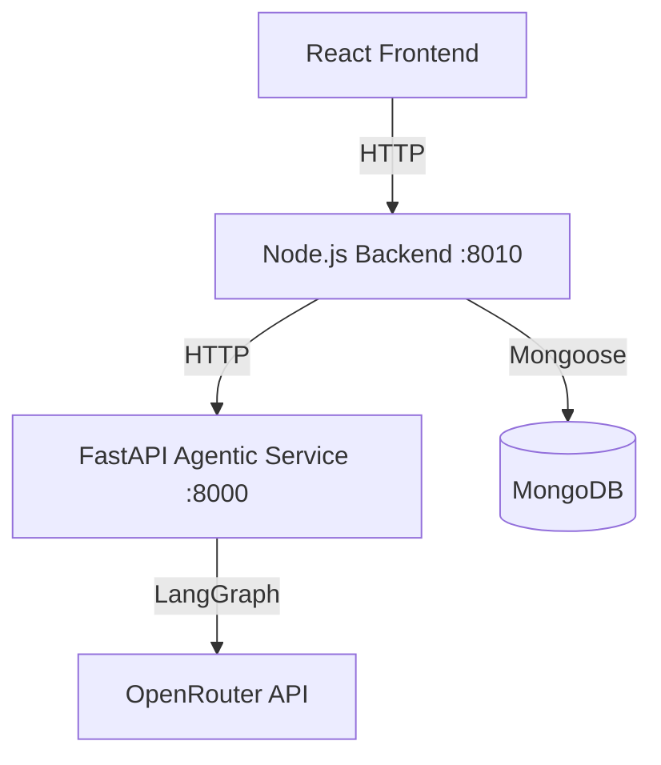

# Talksy AI

Talksy AI is a full-stack AI mock interview platform where users can practice interview rounds, receive AI-generated feedback, track historical performance, and purchase additional interview credits.

<<<<<<< HEAD
The platform supports both a classic mode (pre-generated questions and evaluations) and an **Agentic mode** powered by LangGraph, which adapts questions one-at-a-time based on candidate answers and performs parallel 3C evaluation (Confidence, Communication, Correctness).
=======
It solves a practical interview-prep problem: candidates often do not get realistic, structured practice with actionable feedback. Talksy AI combines resume-based personalization, timed Q&A, and report analytics in one workflow.
>>>>>>> 89ce66c2943ec0d9384582244c587c26344b40f4

Live on : https://talksy-ai-frontend.onrender.com

## Features

### Authentication and User Management

- Email/password signup and login with validation
- Google sign-in integration (Firebase Auth on frontend + backend session creation)
- Cookie-based authenticated session (`userToken` in HTTP-only cookie)
- Current user profile fetch and logout

<<<<<<< HEAD
### AI-Powered Interview Workflows

- **Classic Mode**: Generates all questions up front and evaluates answers sequentially.
- **Agentic Mode (LangGraph)**: Adaptive interview flow that generates questions one-at-a-time based on the candidate's previous responses, topic coverage, and strategy.
- Resume upload and parsing (`pdfjs-dist`) to extract experience, projects, and skills to personalize questions.
- Timed question-by-question interview flow.
- Voice input support via browser speech recognition.
=======
### AI-Powered Interview Workflow

- Resume upload and parsing (`pdfjs-dist`) to extract experience, projects, and skills
- Personalized interview question generation based on:
  - Role
  - Experience level
  - Interview mode (`Technical`, `HR`, `Mixed`)
  - Resume context (skills/projects/text)
- Timed question-by-question interview flow
- Voice input support via browser speech recognition
>>>>>>> 89ce66c2943ec0d9384582244c587c26344b40f4
- AI answer evaluation with structured scoring:
  - Confidence
  - Communication
  - Correctness
<<<<<<< HEAD
  - Synthesized overall feedback and score
=======
  - Final score and feedback
>>>>>>> 89ce66c2943ec0d9384582244c587c26344b40f4

### Reports and History

- Final interview report generation with aggregate metrics
- Question-wise answer + feedback breakdown
- Trend visualization and score insights
- PDF report export (`jsPDF` + `jspdf-autotable`)
- Interview history listing with status and score cards

### Credits and Payments

- Credit-based interview usage (20 credits per generated interview)
- Minimum credit guard before starting interview
- Razorpay order creation and signature verification
- Credit top-up after successful payment verification

### UI/UX

- Modern responsive React UI
- Framer Motion transitions and micro-interactions
- Dashboard-like cards and visual score components

## Tech Stack

### Frontend

- React 19
- Vite
- React Router
- Redux Toolkit + React Redux
- Tailwind CSS (via `@tailwindcss/vite`)
- Framer Motion
- Axios
- Recharts
- `react-speech-recognition`
- `react-circular-progressbar`
- Firebase (Google Auth)
- jsPDF + jspdf-autotable

<<<<<<< HEAD
### Node.js Backend
=======
### Backend
>>>>>>> 89ce66c2943ec0d9384582244c587c26344b40f4

- Node.js
- Express 5
- Mongoose
- JWT + cookie-parser
- bcrypt
- express-validator
- Multer
- Axios
- Razorpay SDK
- pdfjs-dist

<<<<<<< HEAD
### Agentic AI Service

- Python 3.10+
- FastAPI
- LangGraph
- LangChain Core / ChatOpenRouter
- Pydantic v2
- Uvicorn
- python-dotenv

=======
>>>>>>> 89ce66c2943ec0d9384582244c587c26344b40f4
### Database

- MongoDB (via Mongoose)

### External Services

<<<<<<< HEAD
- OpenRouter API (LLM calls for resume analysis, question generation, and LangGraph workflow)
=======
- OpenRouter API (LLM calls for resume analysis, question generation, answer evaluation)
>>>>>>> 89ce66c2943ec0d9384582244c587c26344b40f4
- Razorpay (payments)
- Firebase (Google sign-in)

## Architecture Overview

<<<<<<< HEAD


1. Frontend handles user interaction, interview flow state, and rendering.
2. Node.js backend manages business logic, user authentication, transactions, credits, and database persistence.
3. FastAPI service runs stateless LangGraph agents that decide the next question strategy, generate questions, run parallel evaluations, and maintain the conversation memory (summary).
4. MongoDB persists users, interviews (classic and agentic), and transactions.

---
=======
1. Frontend handles user interaction, interview flow state, and rendering.
2. Backend exposes REST APIs for auth, interview lifecycle, user profile, and payments.
3. MongoDB stores users, interviews, and payment transactions.
4. AI operations are delegated to OpenRouter through backend service calls.
5. Payment operations use Razorpay order APIs and server-side signature verification.

Flow summary:

- User action in React -> Axios request to Express API
- Express validates/authenticates request -> interacts with MongoDB and external services
- Backend returns structured JSON -> frontend updates Redux/local state and UI
>>>>>>> 89ce66c2943ec0d9384582244c587c26344b40f4

## Installation and Setup

### 1. Clone repository

```bash
git clone <your-repo-url>
cd Talksy-ai
```

<<<<<<< HEAD
### 2. Configure Environment Variables

Create the following files:

- `backend/.env`
- `frontend/.env`
- `agentic/.env`

Use the variables listed in the next section.

### 3. Run FastAPI Agentic Service

Ensure Python 3.10+ is installed:

```bash
cd agentic

# Create and activate virtual environment
python -m venv venv
venv\Scripts\activate  # On Windows
# source venv/bin/activate  # On Linux/macOS

# Install python dependencies
pip install -r requirements.txt

# Run development server
uvicorn app.main:app --reload --port 8000
```

### 4. Run Node.js Backend
=======
### 2. Install dependencies
>>>>>>> 89ce66c2943ec0d9384582244c587c26344b40f4

```bash
cd backend
npm install
<<<<<<< HEAD
npm start
```

The backend server runs on `http://localhost:8010` by default.

### 5. Run React Frontend

```bash
cd frontend
npm install
npm run dev
```

The Vite dev server runs on `http://localhost:5173`. When testing locally, it automatically points API requests to the local backend.

---

## Environment Variables

### Agentic Service (`agentic/.env`)

```env
OPENROUTER_API_KEY=your_openrouter_api_key
```

### Node.js Backend (`backend/.env`)

```env
PORT=8010
NODE_ENV=development
MONGO_CONNECTION_STRING=your_mongodb_uri
JWT_SECRET=your_jwt_signing_secret
OPENROUTER_API_KEY=your_openrouter_api_key
RAZORPAY_KEY_ID=your_razorpay_key_id
RAZORPAY_KEY_SECRET=your_razorpay_key_secret
AGENTIC_SERVICE_URL=http://localhost:8000
```

### React Frontend (`frontend/.env`)

```env
VITE_FIREBASE_API=your_firebase_api_key
VITE_FIREBASE_AUTH_DOMAIN=your_firebase_auth_domain
VITE_FIREBASE_PROJECT_ID=your_firebase_project_id
VITE_FIREBASE_STORAGE_BUCKET=your_firebase_storage_bucket
VITE_FIREBASE_MESSAGING_SENDER_ID=your_firebase_sender_id
VITE_FIREBASE_APP_ID=your_firebase_app_id
VITE_FIREBASE_MEASUREMENT_ID=your_firebase_measurement_id
VITE_RAZORPAY_KEY_ID=your_razorpay_key_id
```

---
=======

cd ../frontend
npm install
```

### 3. Configure environment variables

Create:

- `backend/.env`
- `frontend/.env`

Use the variables listed in the next section.

### 4. Update API base URL for local development

In `frontend/routes/App.jsx`, `serverUrl` is currently hardcoded to production:

```js
export const serverUrl = "https://talksy-ai.onrender.com";
```

For local backend, set it to:

```js
export const serverUrl = "http://localhost:<backend-port>";
```

### 5. Run backend

```bash
cd backend
npm start
```

### 6. Run frontend

```bash
cd frontend
npm run dev
```

## Environment Variables

### Backend (`backend/.env`)

```env
PORT=
MONGO_CONNECTION_STRING=
JWT_SECRET=
OPENROUTER_API_KEY=
RAZORPAY_KEY_ID=
RAZORPAY_KEY_SECRET=
NODE_ENV=
```

- `PORT`: backend server port
- `MONGO_CONNECTION_STRING`: MongoDB connection URI
- `JWT_SECRET`: JWT signing/verification secret
- `OPENROUTER_API_KEY`: API key for OpenRouter chat completions
- `RAZORPAY_KEY_ID`: Razorpay public key ID used by server SDK
- `RAZORPAY_KEY_SECRET`: Razorpay secret used for SDK and signature verification
- `NODE_ENV`: affects cookie flags (`secure`, `sameSite`)

### Frontend (`frontend/.env`)

```env
VITE_FIREBASE_API=
VITE_FIREBASE_AUTH_DOMAIN=
VITE_FIREBASE_PROJECT_ID=
VITE_FIREBASE_STORAGE_BUCKET=
VITE_FIREBASE_MESSAGING_SENDER_ID=
VITE_FIREBASE_APP_ID=
VITE_FIREBASE_MEASUREMENT_ID=
VITE_RAZORPAY_KEY_ID=
```

- Firebase keys are used in `frontend/src/utils/firebase.js`
- `VITE_RAZORPAY_KEY_ID` is used by Razorpay Checkout in pricing flow

## API Endpoints

Base URL (local): `http://localhost:<PORT>`

### Auth

- `POST /auth/signup` - Create user and set auth cookie
- `POST /auth/login` - Login and set auth cookie
- `POST /auth/google` - Continue with Google (backend user/session creation)
- `GET /auth/logout` - Clear auth cookie

### Users

- `GET /users/current-user` - Get authenticated user profile and credits

### Interview

- `POST /interview/resume-analyze` - Upload resume file and extract structured resume data
- `POST /interview/generate-questions` - Generate interview questions and deduct 20 credits
- `POST /interview/submit-answer` - Evaluate one answer and return feedback
- `POST /interview/finish` - Finalize interview and return report data
- `GET /interview/my-interviews` - List user interviews
- `GET /interview/report/:interviewId` - Get detailed report for one interview

### Payment

- `POST /payment/order` - Create Razorpay order and payment record
- `POST /payment/verify-payment` - Verify signature and add credits

Note: Most endpoints (except initial auth) require authentication via `userToken` cookie.

````
>>>>>>> 89ce66c2943ec0d9384582244c587c26344b40f4

## Folder Structure

```text
Talksy-ai/
<<<<<<< HEAD
├─ agentic/                      # FastAPI Agentic AI layer
│  ├─ app/
│  │  ├─ main.py                 # FastAPI server setup
│  │  ├─ api/
│  │  │  └─ interview.py         # Start & Answer endpoints
│  │  ├─ graph/
│  │  │  ├─ start_workflow.py    # LangGraph start graph
│  │  │  ├─ answer_workflow.py   # LangGraph answer graph
│  │  │  └─ nodes/               # Evaluators, strategy, memory, and generator nodes
│  │  ├─ prompts/
│  │  │  ├─ templates.py         #戦略, 3C evaluations, summary templates
│  │  │  └─ output_models.py     # Pydantic structured output structures
│  │  └─ llm/
│  │     └─ model.py             # ChatOpenRouter instance (capped max_tokens)
│  ├─ requirements.txt           # Python package dependencies
│  └─ .env                       # LLM service key
├─ backend/                      # Node.js backend API server
│  ├─ app.js                     # Express app bootstrap
│  ├─ controller/
│  │  └─ interviewController.js  # Added startAgenticInterview & submitAgenticAnswer
│  ├─ model/
│  │  └─ interviewModel.js       # Supports agentic state & enums
│  ├─ routes/
│  │  └─ interviewRouter.js      # Added agentic router endpoints
│  └─ services/
│     └─ agenticService.js       # Axios wrapper for FastAPI communication
├─ frontend/                     # React Single Page App
│  ├─ components/
│  │  ├─ Step1Setup.jsx          # Setup with Classic / Agentic toggle option
│  │  └─ Step2interview.jsx      # Speaks and records answers dynamically
│  └─ routes/
│     └─ App.jsx                 # Dynamic server URL detector
```

## API Endpoints

### Auth
- `POST /auth/signup` - Create user and set auth cookie
- `POST /auth/login` - Login and set auth cookie
- `POST /auth/google` - Continue with Google (Firebase integration)
- `GET /auth/logout` - Clear auth cookie

### Users
- `GET /users/current-user` - Get authenticated user profile and credits

### Payments
- `POST /payment/order` - Create Razorpay order
- `POST /payment/verify-payment` - Verify payment and credit allocation

### Interview (Classic)
- `POST /interview/resume-analyze` - Upload and analyze resume
- `POST /interview/generate-questions` - Generate batch questions (deducts 20 credits)
- `POST /interview/submit-answer` - Submit and evaluate answer
- `POST /interview/finish` - Finish interview and finalize report

### Interview (Agentic)
- `POST /interview/agentic/start` - Generate first question and initialize LangGraph state (deducts 20 credits)
- `POST /interview/agentic/answer` - Evaluate answer, compute 3C scoring, updates memory, and generate next question adaptive to candidate performance

---
=======
├─ backend/
│  ├─ app.js                     # Express app bootstrap
│  ├─ config/connectDB.js        # MongoDB connection
│  ├─ controller/                # Auth, interview, payment, user controllers
│  ├─ middleware/                # Auth guard + Multer upload config
│  ├─ model/                     # Mongoose models: User, Interview, Payment
│  ├─ routes/                    # API route modules
│  └─ services/                  # OpenRouter + Razorpay service wrappers
├─ frontend/
│  ├─ routes/                    # Page-level route components
│  ├─ components/                # Reusable UI and interview step components
│  ├─ src/
│  │  ├─ redux/                  # App store + user slice
│  │  ├─ utils/firebase.js       # Firebase config/auth provider
│  │  ├─ App.css                 # Global styles and utilities
│  │  └─ main.jsx                # App entry and router setup
│  ├─ index.html                 # Includes Razorpay checkout script
│  └─ vite.config.js
└─ README.md
````

## Usage

Typical user flow:

1. Sign up/login (email-password or Google).
2. Open `MockHire` and fill role, experience, mode, and interview length.
3. Optionally upload resume to personalize generated questions.
4. Start interview (20 credits deducted).
5. Answer each timed question (typed or speech-to-text).
6. Receive per-question feedback and continue.
7. Finish interview and review final report with score breakdown.
8. Download PDF report and revisit results in Interview History.
9. If credits are low, purchase a plan from Pricing.
>>>>>>> 89ce66c2943ec0d9384582244c587c26344b40f4

## Contributing

1. Fork the repository
2. Create a feature branch
3. Commit focused, descriptive changes
<<<<<<< HEAD
4. Open a pull request with details of changes and validation testing.
=======
4. Open a pull request with:
   - What changed
   - Why it changed
   - How it was tested
>>>>>>> 89ce66c2943ec0d9384582244c587c26344b40f4
